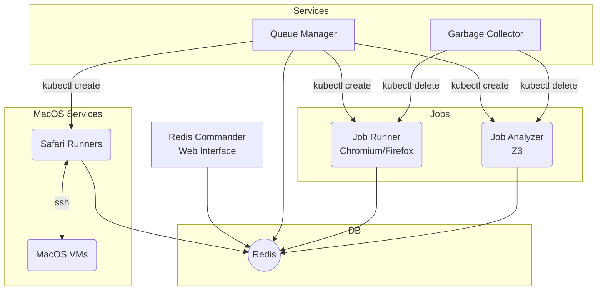

# Trace Verification Pipeline - Kubernetes Deployment

## Architecture

The architecture of the system is shown in the following graph.



The execution is controlled by two work queues in Redis: the `runner` queue stores the names of the tests that need to be executed for every browser and the `analyzer` queue the execution traces that need to be analyzed with the SMT solver. 
- The *Queue Manager* and *Garbage Collector* containers have access to the kubernetes API and monitor the work queues in Redis to deploy or delete the *Runner* and *Analyzer* jobs.
- The *Runner* Job runs the `wpt-runner` container for a specific browser (Firefox/Chromium) and pushes the result in JSON format on Redis.
- The *Analyzer* Job fetches a JSON execution traces generated by a runner and executes the Z3 theorem prover on the parsed trace. Analysis results are saved on Redis.
- The *Redis Commander* web interface is exposed on port 8081 as a graphical UI for Redis.

These components are defined in the [pipeline.yaml](pipeline.yaml) file.

The MacOS runner, defined in [safari_runner.yaml](safari_runner.yaml), executes (for each replica) a MacOS virtual machine and a linux container that fetches tests from Redis and executes them via ssh on the MacOS machine, storing the result on Redis. The Mac OS virtual machine is stored in the file `/home/sp/mac_hdd_ng.img` (line 24) and was set-up following the steps outlined in the [../runner/safari](runner/safari) folder. For licensing reasons, we cannot redistribute this file, so line 24 of the yaml file needs to be updated to refer to a working Mac OS disk image.

## Usage

The pipeline can be deployed using the following command (assuming a valid kubeconfig set-up):

```sh
make deploy
```
Note that all resources are deployed in the `default` namespace.


Jobs can be started by writing a record on Redis specifying the browser and the subfolder of WPT to run:
```sh
redis-cli -u redis://[CLUSTER-ENTRYPOINT]:6379 hset wpt browser firefox
redis-cli -u redis://[CLUSTER-ENTRYPOINT]:6379 hset wpt test cookies
```
The above commands will result in the *Queue Manager* container adding all tests of the `cookies` WPT folder to the work queue for the `firefox` browser.

The pipeline status can be monitored by ispecting the `runner:firefox` and `analyzer` queues.

Once the queues are empty, the results can be indexed by invariant and result (i.e., `sat`/`unsat`) using the following command:
```sh
./redis_reindex_results.pl [CLUSTER-ENTRYPOINT]
```
Note that the above command requires a working installation of SWI-Prolog.

After reindexing, the list of results are stored as subkeys of `invariants`. 
Specifically:
```
invariants:0-Inf:[INVARIANT-NAME]:[BROWSER-NAME]:[RESULT]
```
